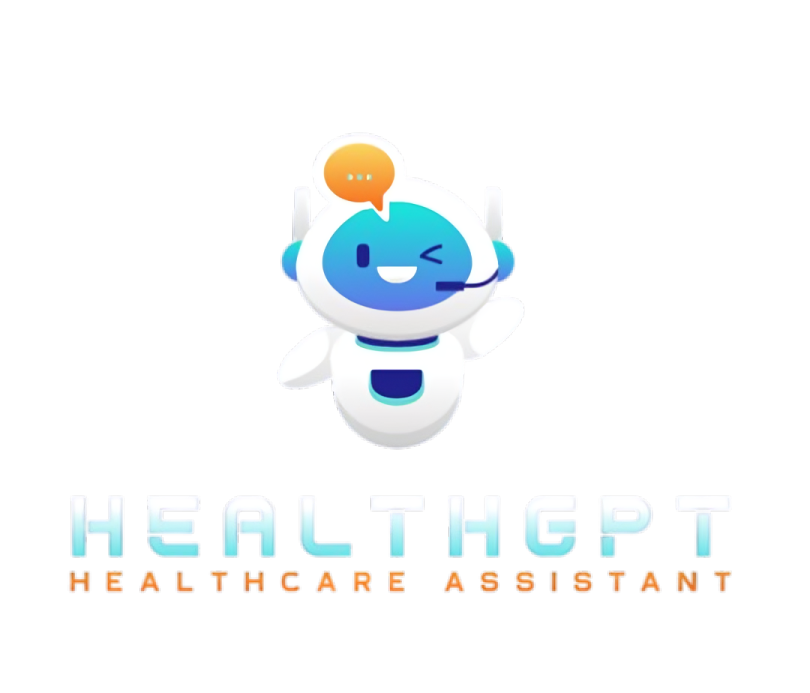

# HealthGPT - AI Healthcare Assistant

An intelligent healthcare assistant powered by AI that provides personalized health information and guidance.



## Features

- 🏥 **AI-Powered Chat**: Interact with an intelligent healthcare assistant
- 👤 **Patient Profiles**: Manage personal health information
- 📋 **Medical History**: Track conditions, medications, and allergies
- 📊 **Patient Dashboard**: View health information at a glance
- 🎨 **Modern UI**: Beautiful dark theme with smooth animations

## Technology Stack

- **Frontend**: Streamlit
- **AI Model**: Ollama (gpt-oss:120b-cloud)
- **Integration**: LangChain-Ollama
- **Language**: Python 3.10+

## Installation

### Prerequisites

1. Python 3.10 or higher
2. Ollama installed and running

### Setup

1. Clone the repository:
```bash
git clone <your-repo-url>
cd <repo-name>
```

2. Install dependencies:
```bash
pip install -r requirements.txt
```

3. Start Ollama server:
```bash
ollama serve
```

4. Pull the required model:
```bash
ollama pull gpt-oss:120b-cloud
```

5. Run the application:
```bash
streamlit run app.py
```

6. Open your browser and navigate to `http://localhost:8501`

## Usage

1. **Fill in your patient profile** in the sidebar:
   - Enter your name, age, and gender
   - Add medical conditions
   - List current medications
   - Note any allergies
   - Record your last checkup date

2. **Ask health-related questions** in the chat interface

3. **View your dashboard** to see your health information summary

## Deployment

### Deploy to Render

1. Push your code to GitHub
2. Create a new Web Service on Render
3. Connect your GitHub repository
4. Use these settings:
   - **Build Command**: `pip install -r requirements.txt`
   - **Start Command**: `streamlit run app.py --server.port=$PORT --server.address=0.0.0.0`

**Note**: For Render deployment, you'll need to use a cloud-based LLM API instead of local Ollama.

## Project Structure

```
.
├── app.py              # Main application file
├── config.py           # Configuration settings
├── components.py       # UI components
├── utils.py            # Utility functions
├── requirements.txt    # Python dependencies
├── logo.png           # Application logo
├── notes.txt          # Project documentation
└── README.md          # This file
```

## Important Disclaimer

⚕️ **Medical Disclaimer**: HealthGPT is an AI assistant and should not be used as a substitute for professional medical advice, diagnosis, or treatment. Always seek the advice of your physician or other qualified health provider with any questions you may have regarding a medical condition.

## Security & Privacy

- All data is stored in session state only
- No persistent storage or database
- Data is cleared when the browser session ends
- No external API calls except to the configured LLM server

## Known Limitations

- Requires Ollama server running locally
- Chat history is not persistent (session-based only)
- No user authentication
- AI responses are not medically verified

## Future Enhancements

- Database integration for persistent storage
- User authentication
- Export chat history
- Medication reminders
- Health metrics tracking
- Multi-language support

## License

This is an educational/demonstration project. Not intended for actual medical diagnosis or treatment.

## Contributing

Contributions are welcome! Please feel free to submit a Pull Request.

## Support

For issues or questions, please open an issue on GitHub.
